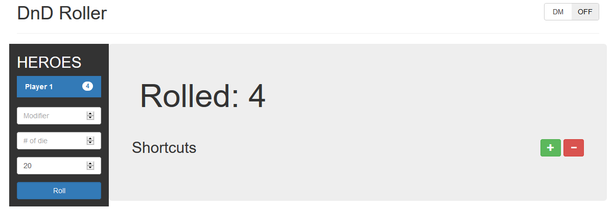

# D&D Roller
## A web based D&D roller using socket.io



This is a simple roller using socket.io to connect D&D players and display other's rolls.

### Features
* Roll n-sided die (upper limit of d100)
* Add modifier to final roll (negative and positive values)
* Roll n amount of times (upper limit of 100)
* Save shortcuts for common roles
* DM mode for hiding roll results from other players
* All preferences are saved to the user's web browser

### How to Run
```
npm install
npm start
```